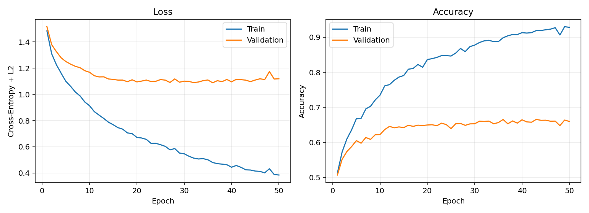
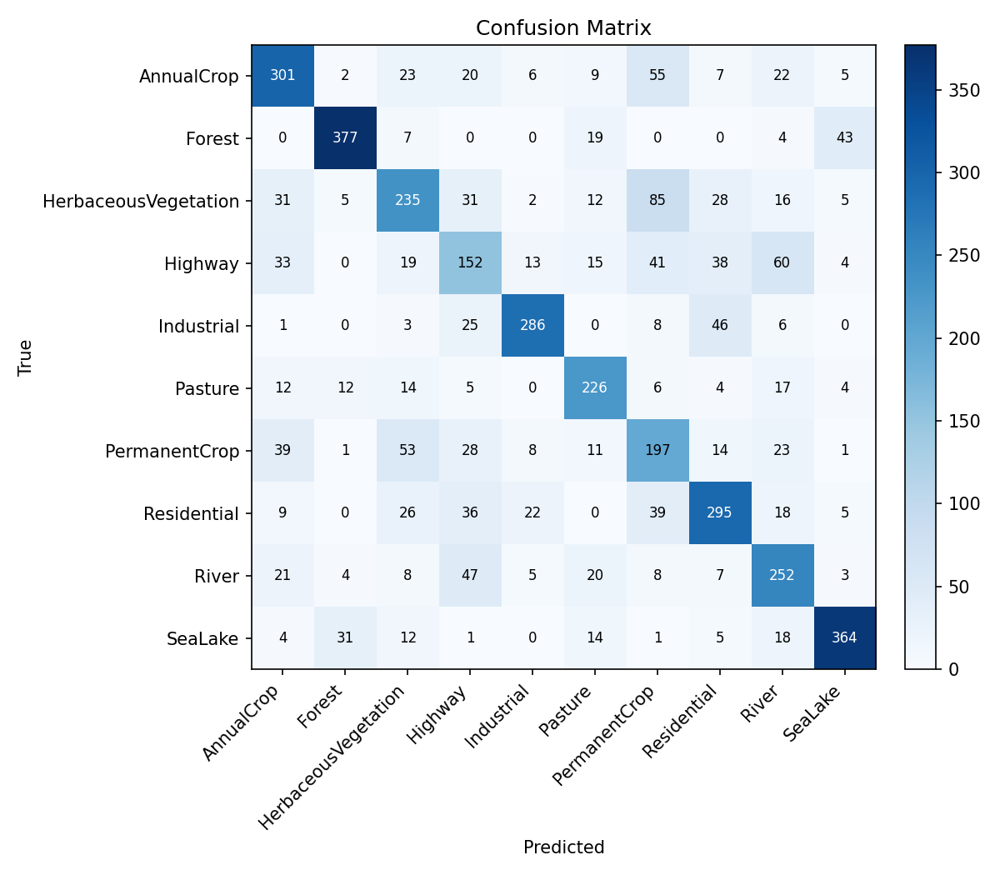
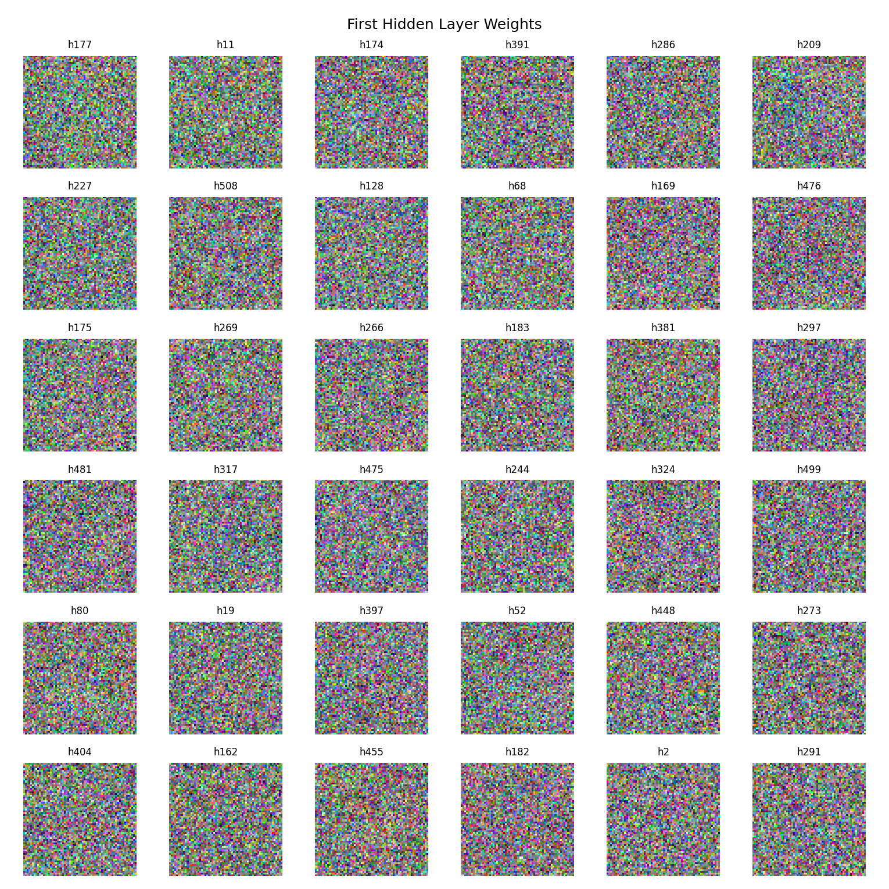
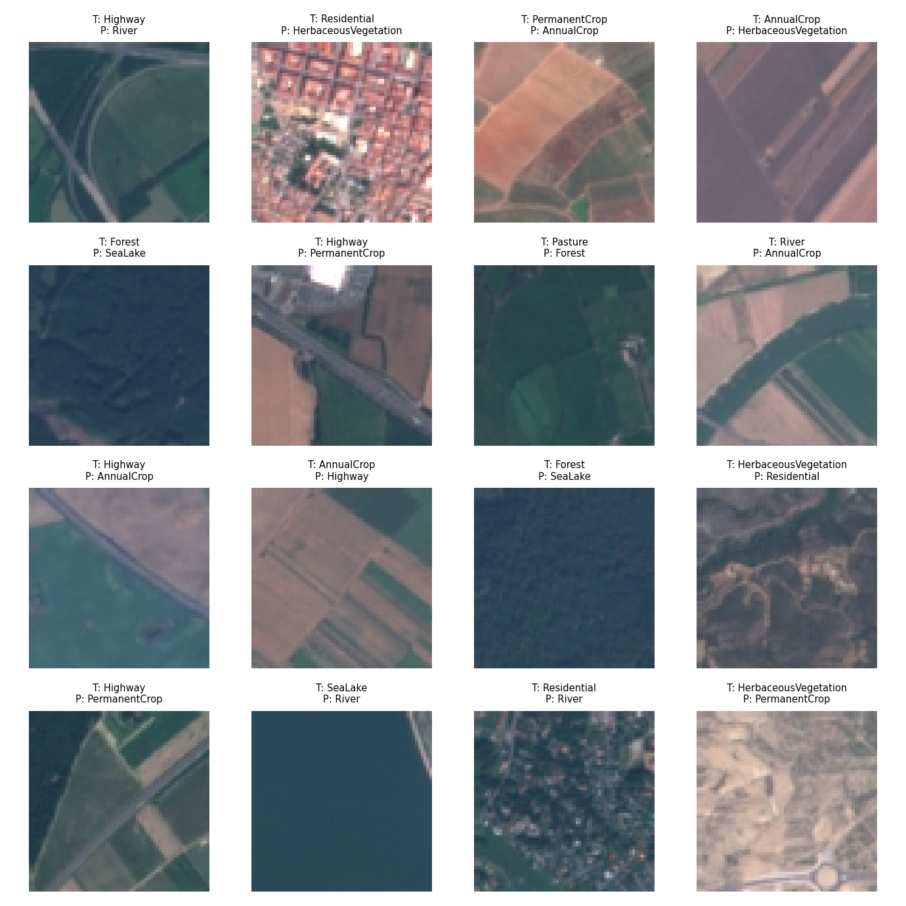

# HW1 实验报告
## 学号：25210980036
## 姓名：付晨溪

## 1. 任务概述

本次实验要求在 EuroSAT_RGB 遥感图像数据集上手工搭建一个多层感知机（MLP）分类器，实现基于卫星图像的土地覆盖分类。EuroSAT_RGB 数据集包含 10 个类别：AnnualCrop、Forest、HerbaceousVegetation、Highway、Industrial、Pasture、PermanentCrop、Residential、River 和 SeaLake。

根据要求，本实验不使用 PyTorch、TensorFlow、JAX 等自动微分深度学习框架，而是使用 NumPy 完成矩阵运算，并手动实现前向传播、交叉熵损失、L2 正则化、反向传播、SGD 优化器、学习率衰减、验证集最优模型保存、测试集准确率与混淆矩阵输出。

## 2. 数据集与预处理

数据位于 `EuroSAT_RGB` 文件夹下，原始目录按类别组织。为了形成可复现的训练、验证和测试流程，实验采用分层随机划分方式，保证每个类别在训练集、验证集和测试集中均有样本。划分比例为：

| 数据划分 | 比例 |
|---|---|
| 训练集 | 70% |
| 验证集 | 15% |
| 测试集 | 15% |

图像预处理流程如下：

1. 将所有图像读取为 RGB 格式。
2. 统一调整为 `64 × 64 × 3`。
3. 将像素值从 `[0, 255]` 缩放到 `[0, 1]`。
4. 将图像展平为长度为 `12288` 的向量。
5. 使用训练集均值和标准差对训练集、验证集和测试集进行标准化。

## 3. 模型结构与代码结构

本实验实现的 MLP 结构为三层神经网络：

| 神经网络层 | 宽度 |
|---|---|
| 输入层 | 12288 |
| 第一隐藏层 | 512 |
| 第二隐藏层 | 512 |
| 输出层 | 10 |

在前向传播的过程中，每一个隐藏层首先将输入进来的向量乘以该层的权重矩阵，并加入偏置向量。接下来，使用激活函数进行激活，并将结果传递到下一层。输出层将输入进来的向量乘以该层的权重矩阵并加入偏置向量后，使用 Softmax 将 logits 转换为 10 个类别上的概率分布。

在反向传播的过程中，输出层的梯度由损失函数直接得到，并逐层链式回传到每一层的权重矩阵以及偏置向量。

本项目代码采用模块化组织，各 Python 文件职责如下：

| 文件 | 主要功能 |
|---|---|
| `train.py` | 训练入口脚本，负责解析训练参数、构建数据集和模型、执行训练循环、应用 SGD 更新、学习率衰减、梯度裁剪、验证集最优权重保存，并在训练结束后输出曲线、混淆矩阵、错例图和第一层权重可视化。 |
| `evaluate.py` | 测试入口脚本，负责加载 `best_model.npz` 中保存的模型参数和标准化统计量，在相同数据划分下取测试集进行评估，输出测试 Accuracy、混淆矩阵和错例图。 |
| `search.py` | 超参数查找脚本，负责遍历不同隐藏层宽度、激活函数、学习率、学习率衰减和正则化强度组合，并将每组实验结果写入 `search_results.csv`，便于观察并记录模型在不同超参数组合下的性能变化。 |
| `mlp_eurosat/data.py` | 数据处理模块，负责读取 `EuroSAT_RGB` 中按类别存放的图像，完成 RGB 转换、尺寸统一、展平、按类别分层划分训练/验证/测试集，以及基于训练集均值和标准差进行标准化。 |
| `mlp_eurosat/model.py` | 模型核心模块，定义 NumPy 版 MLP，包含权重初始化、ReLU/Sigmoid/Tanh 激活函数、Softmax、交叉熵损失、L2 正则项、手写反向传播、参数更新、模型保存和加载。 |
| `mlp_eurosat/metrics.py` | 指标模块，提供 Accuracy 和 Confusion Matrix 的计算函数，用于训练过程监控和测试集最终评估。 |
| `mlp_eurosat/visualize.py` | 可视化模块，负责绘制训练/验证 Loss 与 Accuracy 曲线、测试集混淆矩阵、第一层隐藏层权重图像，以及分类错误样本图。 |
| `mlp_eurosat/__init__.py` | 包初始化文件，用于将 `mlp_eurosat` 目录组织为可导入的 Python 包。 |

## 4. 损失函数与优化方法

分类损失使用交叉熵损失：

$$L_{ce} = -\frac{1}{N}\sum_{i=1}^{N}\log p(y_i \mid x_i)$$

同时加入 L2 正则化，也就是 Weight Decay：

$$L = L_{ce} + \frac{\lambda}{2}\sum \lVert W\rVert^2$$

本实验中$\lambda = 1 \times 10^{-4}$。优化器采用手写 SGD，每个 mini-batch 计算梯度后更新参数：

$$W \leftarrow W - lr \cdot dW$$

$$b \leftarrow b - lr \cdot db$$

学习率采用指数衰减：

$$lr_{\text{epoch}} = lr_{\text{initial}} \times decay^{epoch - 1}$$

本次实验使用初始学习率 0.005，衰减系数 0.99，batch size 为 128，训练 50 个 epoch。训练过程中根据验证集 Accuracy 自动保存最佳模型权重。

## 5. 实验设置

| 项目 | 设置 |
|---|---|
| 数据集 | EuroSAT_RGB |
| 类别数 | 10 |
| 图像尺寸 | 64 × 64 × 3 |
| 输入维度 | 12288 |
| 隐藏层宽度 | 512 |
| 激活函数 | ReLU |
| 优化器 | SGD |
| 初始学习率 | 0.005 |
| 学习率衰减 | 0.99 |
| L2 正则化强度 | 0.0001 |
| Batch size | 128 |
| Epochs | 50 |
| 随机种子 | 42 |

模型训练命令如下：

`python train.py --data-dir EuroSAT_RGB --output-dir outputs/run1 --epochs 50 --hidden-dim 512,512 --batch-size 128 --activation relu --lr 0.005 --lr-decay 0.99 --weight-decay 0.0001 --grad-clip 5.0`

## 6. 训练过程分析

训练过程中，模型在训练集上的准确率从第 1 轮的 51.33% 提升到第 50 轮的 92.82%；验证集准确率最高达到 66.59%，出现在第 43 轮。训练集准确率持续提升，而验证集准确率在第 30 轮后基本不再提高，说明模型已经开始出现一定过拟合趋势。

训练曲线如下图所示：

从训练曲线可以看出，训练集 loss 总体下降明显，训练集 accuracy 持续上升；验证集 loss 和 accuracy 在中后期趋于平稳，说明仅使用 MLP 对展平后的图像做分类时，模型对局部空间结构的利用能力有限，泛化能力受到一定限制。

## 7. 超参数查找

本实验通过调节初始学习率、隐藏层宽度、L2 正则化强度以及激活函数，观察模型在不同超参数组合下的性能变化，并采用最优的模型作为测试模型。对下表展示的超参数组合进行了尝试：

| 超参数 | 设置 |
|---|---|
| 初始学习率 | 0.001/0.005/0.01 |
| 隐藏层宽度 | 128/256/512 |
| L2 正则化强度 | 0/0.0001/0.0002 |
| 激活函数 | ReLU/Tanh |

超参数查找命令如下：
`python search.py --data-dir EuroSAT_RGB --output-dir outputs/search --epochs 50 --hidden-dims 128,256,512 --activations relu,tanh --lrs 0.001,0.005,0.01 --weight-decays 0,0.0001,0.0002`

最终结果显示，设置初始学习率 lr = 0.005，隐藏层宽度为 512，L2 正则化强度为 0.0001，激活函数为 ReLU 时，模型能够达到最优性能。因此，最终采用该超参数设置下验证集 Accuracy 最好的第 43 轮模型作为测试模型。

## 8. 模型测试与混淆矩阵

本实验利用权重最优的测试模型在测试集上进行测试。

模型测试命令如下：
`python evaluate.py --data-dir EuroSAT_RGB --model outputs/run1/best_model.npz --output-dir outputs/eval_run1`

测试模型在测试集上的 Accuracy 为 66.30%。

测试集混淆矩阵如下：

混淆矩阵的对角线颜色越深，表示该类越容易被正确识别。从混淆矩阵可以观察到：

1. Forest 类与 SeaLake 类识别效果较好，说明这两类区域的颜色和纹理特征较明显。
2. Industrial 类和 Residential类等类别也有一定区分度，但仍存在混淆。
3. HerbaceousVegetation 类和 PermanentCrop 类的识别效果较差，这两类都属于植被覆盖场景，颜色和纹理相似，使用展平图像的 MLP 难以稳定捕捉差异。
4. Highway 类与 River 类存在明显混淆。两者都可能呈现细长条带状结构，且在遥感图像中与周围背景交织，MLP 缺少卷积结构，难以充分利用连续线性空间模式。

## 9. 第一层权重可视化与空间模式观察

实验要求将第一层隐藏层权重矩阵恢复成图像尺寸并进行可视化。本实验将 `W1` 中范数较大的若干隐藏单元权重 reshape 为 `64 × 64 × 3` 后显示：

从可视化结果可以看出，这些权重整体比较分散，缺少 CNN 卷积核常见的清晰边缘、角点或局部纹理模式。这与 MLP 将图像直接展平有关。由于模型参数直接连接每一个像素位置，因此图像的局部领域关系在第一层就被打散了，缺少平移共享和局部感受野，所以难以系统性地学习类似“河流”、“森林”这些类别的局部色彩倾向或空间纹理特征。

## 10. 错例分析

测试集中的部分错分样例如下：

结合错例和混淆矩阵，可以总结出以下几类错误原因：

1. Highway 类与 River 类的视觉结构相似。两类都可能呈现细长、弯曲或穿过图像的线状区域，在低分辨率遥感图像中容易混淆。
2. HerbaceousVegetation 类、PermanentCrop 类和 AnnualCrop 类等植被相关类别之间颜色接近，且纹理差异较细。MLP 对局部空间排列建模能力较弱，因此难以稳定区分不同农业或植被场景。
3. Forest 类与 Pasture 类、SeaLake 类的局部颜色可能接近。尤其当图像中存在大面积深绿色区域时，模型容易依赖颜色而非高级语义结构。
4. Residential 类有时包含浅色屋顶、规则网格和道路结构，在没有卷积特征提取的情况下容易与别的类出现混淆。

总体来看，MLP 能够利用全局颜色分布和部分位置相关特征完成基础分类，但对遥感图像中细粒度空间纹理和形状结构的表达能力有限。

## 11. 结论

本实验使用 NumPy 从零实现了一个 EuroSAT_RGB 图像分类 MLP，完整实现了数据加载与预处理、模型定义、交叉熵损失、L2 正则化、反向传播、SGD、学习率衰减、验证集最优权重保存、测试集 Accuracy 和混淆矩阵输出等模块。实验结果表明，模型最佳验证集 Accuracy 为 66.59%，测试集 Accuracy 为 66.30%。

从训练曲线来看，模型能够有效降低训练集损失并提升训练集准确率，但验证集表现较早进入平稳期，说明 MLP 对图像空间结构的表达能力有限。第一层权重可视化显示模型学习到了一些颜色和大尺度空间响应，但缺少清晰的局部纹理模式。混淆矩阵和错例分析进一步说明，视觉相似类别之间的混淆是主要错误来源，尤其是 Highway/River 类以及多种植被覆盖类别之间的混淆。

## 12. 代码与模型权重

GitHub Repo 链接：

`TODO: 填写 Public GitHub Repo 链接`

最优模型权重下载地址：

`TODO: 填写 Google Drive 或其他网盘下载链接`

最优模型权重本地路径：

`outputs/run1/best_model.npz`